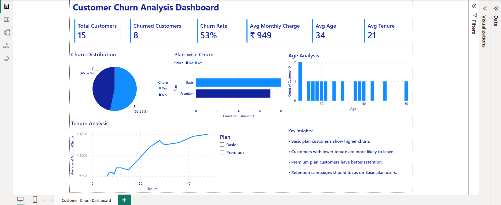

# Customer Churn Analysis Dashboard

## Overview

Interactive dashboard built using SQL, Power BI, Python and Streamlit.

## Features

* Data Cleaning
* SQL Analysis
* Customer Churn Analysis
* Churn Rate Calculation
* Plan-wise Churn Analysis
* Age Analysis
* Tenure Analysis
* Interactive Dashboard

## Tools

* Python
* Pandas
* SQLite
* Power BI
* Streamlit

## Dashboard Metrics

* Total Customers
* Churned Customers
* Churn Rate
* Average Monthly Charge
* Average Age
* Average Tenure

## Deployment

Streamlit App

## Dashboard Preview

